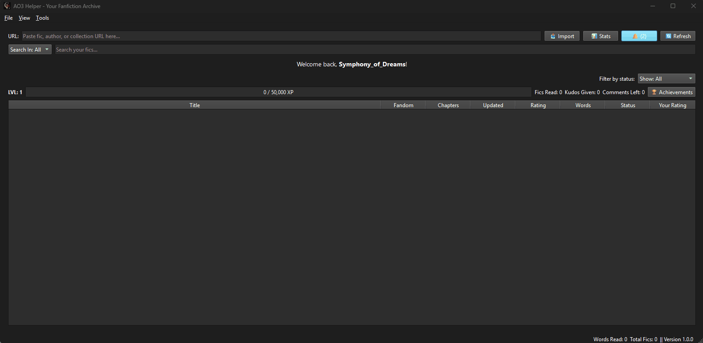

# AO3 Helper 📖✨

[](https://www.python.org/) [](https://opensource.org/licenses/MIT)

**AO3 Helper** is your personal desktop archive and reading toolkit for Archive of Our Own (AO3), designed for power readers who want to go beyond browser bookmarks and gain full control over their fanfiction library.



## Core Philosophy: Your Data is Yours. Period.

This application was built with a "privacy-first" principle. We believe you should have complete ownership of your reading data.

*   **🛡️ 100% Local:** All your data (fic list, notes, ratings, credentials, and history) is stored **ONLY** on your computer. Nothing is ever sent to a third-party server. The code is open-source for you to verify.
*   **🔒 Secure Credentials:** Your AO3 password is never stored in a plain text file. It is handled by the `keyring` library, which saves it securely in the Windows Credential Manager, your operating system's native keychain.
*   **🤝 Direct Communication:** The app communicates only and directly with Archive of Our Own's servers, exactly as your web browser does.

## Features Overview

*   **📚 Smart Importer:** Paste any AO3 URL (work, author, series, or collection) to import fics into your local library.
*   **🕓 Full Reading History Integration:**
    *   Import your **entire** AO3 reading history to create a complete, private archive of everything you've ever read.
    *   Enjoy **intelligent incremental syncs** that quickly fetch only your newest reads without re-importing everything.
    *   Use the **"Inbox" view** to see fics from your history that you haven't formally added to your library yet.
*   **🔍 Advanced Library Management:**
    *   Instantly sort, search, and filter your archive by dozens of fields.
    *   View all fic metadata, notes, and tags in a detailed side panel.
    *   Add personal notes, 5-star ratings, and custom organizational tags to any fic.
*   **⚡ Power User Tools:**
    *   **Automated Status Sync:** Connect your AO3 account to automatically verify your Kudos & Comment status across your entire library.
    *   **Bulk Editing:** Select multiple fics at once to efficiently change their status or manage tags.
*   **📊 Reading Statistics:**
    *   Analyze your reading habits with interactive charts and word clouds.
    *   Track your top fandoms, categories, ratings, and see your reading history by publication year.
*   **🏆 Gamification & Achievements:** Unlock achievements and level up based on the words and fics you've read.
*   **🎨 Customization:** Switch between Light and Dark themes to suit your preference.

## 🚀 What's Next? The Road to v1.7.0

The new Reading History data is the foundation for our next major feature: the **Advanced Reader Insights Dashboard**. Soon, you'll be able to answer questions like:
*   "Which stories have I re-read the most?"
*   "What were my most active reading months or years?"
*   "Based on my actual reading habits, who are my *true* favorite authors and what are my comfort tags?"

## Installation & Usage

You have two options for running AO3 Helper. The recommended method for most users is the installer.

### Option 1: For End-Users (Recommended)

1.  Go to the project's **[Releases Page](https://github.com/Symphony-of-Dreams/ao3-helper/releases)**.
2.  Download the `setup.exe` file from the latest release.
3.  Run the installer.

> **⚠️ A Note on Antivirus Software**
>
> Upon first launch, your antivirus software (including Windows Defender) might flag the `.exe` as a potential threat. **This is a false positive.** It happens because the executable is not "code-signed" by a registered company, a costly process for independent developers.
>
> The application is completely safe to use. You can verify this by examining the source code in this repository.

### Option 2: For Developers (Running from Source)

If you prefer to run the application directly from the source code, you can do so by following these steps:

1.  **Install Python:** Ensure you have Python 3.11 or newer installed.
2.  **Clone the repository:**
    ```bash
    git clone https://github.com/Symphony-of-Dreams/ao3-helper.git
    cd ao3-helper
    ```
    
3.  **Create a virtual environment:**
    ```bash
    python -m venv venv
    venv\Scripts\activate  # On Windows
    ```
    
4.  **Install dependencies:**
    ```bash
    pip install -r requirements.txt
    ```
5.  **Run the application:**
    ```bash
    python main.py
    ```

## Tech Stack

*   **GUI:** PyQt6
*   **Database:** SQLite 3 with **Peewee (ORM)**
*   **AO3 Interaction:** AO3
*   **Credential Management:** keyring
*   **Data Visualization:** Matplotlib & wordcloud

## License

This project is licensed under the MIT License. See the [LICENSE](LICENSE) file for details.


